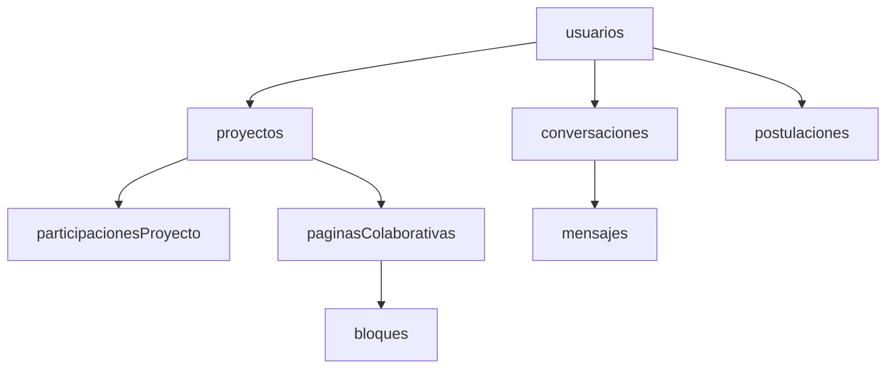

# 🚀 UNION API - Documentación Completa

> **Plataforma de colaboración universitaria para proyectos estudiantiles**

## 📋 Índice

- [🔍 Información General](#-información-general)
- [🏗️ Arquitectura](#️-arquitectura)
- [🔐 Autenticación](#-autenticación)
- [📊 Logging y Monitoreo](#-logging-y-monitoreo)
- [📁 Estructura de Endpoints](#-estructura-de-endpoints)
- [🗃️ Base de Datos](#️-base-de-datos)
- [🛠️ Guías de Desarrollo](#️-guías-de-desarrollo)

---

## 🔍 Información General

### Descripción del Proyecto
UNION es una API REST desarrollada en **TypeScript + Node.js + Express** que facilita la colaboración entre estudiantes universitarios para crear, gestionar y validar proyectos académicos.

### Tecnologías Principales
- **Runtime**: Node.js con TypeScript
- **Framework**: Express.js
- **Base de Datos**: PostgreSQL
- **ORM**: Drizzle ORM
- **Validación**: Zod
- **Autenticación**: JWT
- **Logging**: Sistema personalizado con categorización

### Características Clave
- ✅ Autenticación y autorización basada en roles
- ✅ Gestión de proyectos colaborativos
- ✅ Sistema de validación académica
- ✅ Foros y mensajería
- ✅ Ofertas laborales y oportunidades
- ✅ Logging avanzado con métricas de rendimiento
- ✅ Auditoría completa de operaciones

---

## 🏗️ Arquitectura

### Estructura del Proyecto
```
api/
├── src/
│   ├── db/                     # Schemas de base de datos
│   ├── middlewares/            # Middlewares personalizados
│   ├── routes/                 # Endpoints organizados por módulo
│   ├── types/                  # Definiciones de tipos
│   └── utils/                  # Utilidades (logger, swagger)
├── api-docs/                   # Documentación completa
└── backup_controllers/         # Backups automáticos
```

### Patrones de Diseño
- **MVC**: Separación de responsabilidades
- **Middleware Pattern**: Para autenticación, validación y logging
- **Repository Pattern**: Abstracción de acceso a datos
- **Singleton**: Para logger y conexión DB

### Variables de Entorno
```env
DATABASE_URL=postgresql://...
LOG_LEVEL=DEBUG|INFO|WARN|ERROR
NODE_ENV=development|production
JWT_SECRET=your_secret_here
REQUEST_ID_HEADER=x-request-id
```

---

## 🔐 Autenticación

### Sistema de Roles
1. **Admin**: Acceso completo del sistema
2. **Universidad**: Gestión institucional
3. **Usuario**: Acceso estándar a funcionalidades

### Endpoints de Autenticación
- `POST /auth/register` - Registro de usuarios
- `POST /auth/login` - Inicio de sesión
- `POST /auth/refresh` - Renovación de tokens
- `POST /auth/logout` - Cierre de sesión

### Headers Requeridos
```http
Authorization: Bearer <jwt_token>
Content-Type: application/json
x-request-id: <unique_request_id>
```

---

## 📊 Logging y Monitoreo

### Categorías de Logging
- **HTTP**: Requests y responses
- **DATABASE**: Operaciones de BD
- **AUTH**: Autenticación y autorización
- **VALIDATION**: Validación de datos
- **BUSINESS**: Lógica de negocio
- **SECURITY**: Eventos de seguridad
- **PERFORMANCE**: Métricas de rendimiento
- **AUDIT**: Auditoría de operaciones

### Niveles de Log
- **ERROR**: Errores críticos
- **WARN**: Advertencias
- **INFO**: Información general
- **DEBUG**: Información de debug
- **TRACE**: Información detallada

---

## 📁 Estructura de Endpoints

### Módulos Principales

#### 👥 Gestión de Usuarios
- [`/usuarios`](./endpoints/usuarios.md) - CRUD de usuarios
- [`/perfiles`](./endpoints/perfiles.md) - Perfiles de usuario
- [`/userSkills`](./endpoints/userSkills.md) - Habilidades de usuarios
- [`/rolesUsuario`](./endpoints/rolesUsuario.md) - Roles del sistema

#### 🏛️ Institucional
- [`/universidades`](./endpoints/universidades.md) - Gestión de universidades
- [`/tokensInicialesAcceso`](./endpoints/tokensInicialesAcceso.md) - Tokens de acceso inicial

#### 📚 Proyectos y Colaboración
- [`/proyectos`](./endpoints/proyectos.md) - Gestión de proyectos
- [`/participacionesProyecto`](./endpoints/participacionesProyecto.md) - Participaciones
- [`/rolesProyecto`](./endpoints/rolesProyecto.md) - Roles en proyectos
- [`/projectTechnologies`](./endpoints/projectTechnologies.md) - Tecnologías
- [`/paginasColaborativas`](./endpoints/paginasColaborativas.md) - Páginas colaborativas
- [`/bloques`](./endpoints/bloques.md) - Bloques de contenido
- [`/versionesBloques`](./endpoints/versionesBloques.md) - Versionado
- [`/relacionesBloques`](./endpoints/relacionesBloques.md) - Relaciones

#### 💼 Oportunidades Laborales
- [`/ofertasLaborales`](./endpoints/ofertasLaborales.md) - Ofertas de trabajo
- [`/postulacionesLaborales`](./endpoints/postulacionesLaborales.md) - Postulaciones
- [`/oportunidades`](./endpoints/oportunidades.md) - Oportunidades académicas
- [`/postulaciones`](./endpoints/postulaciones.md) - Postulaciones académicas

#### 📅 Eventos
- [`/eventos`](./endpoints/eventos.md) - Gestión de eventos
- [`/asistenciasEvento`](./endpoints/asistenciasEvento.md) - Asistencias
- [`/eventTypes`](./endpoints/eventTypes.md) - Tipos de eventos

#### 💬 Comunicación
- [`/foros`](./endpoints/foros.md) - Foros de discusión
- [`/hilos`](./endpoints/hilos.md) - Hilos de foros
- [`/respuestasHilo`](./endpoints/respuestasHilo.md) - Respuestas
- [`/conversaciones`](./endpoints/conversaciones.md) - Conversaciones privadas
- [`/mensajes`](./endpoints/mensajes.md) - Mensajes

#### 🏷️ Sistema de Tags
- [`/tags`](./endpoints/tags.md) - Etiquetas
- [`/taggables`](./endpoints/taggables.md) - Asignación de tags

#### 📊 Sistema y Configuración
- [`/systemStates`](./endpoints/systemStates.md) - Estados del sistema
- [`/contentTypes`](./endpoints/contentTypes.md) - Tipos de contenido
- [`/experienceTypes`](./endpoints/experienceTypes.md) - Tipos de experiencia
- [`/opportunityTypes`](./endpoints/opportunityTypes.md) - Tipos de oportunidades
- [`/workModalities`](./endpoints/workModalities.md) - Modalidades de trabajo
- [`/permissionTypes`](./endpoints/permissionTypes.md) - Tipos de permisos

#### 🔒 Permisos y Validaciones
- [`/collaborativePagePermissions`](./endpoints/collaborativePagePermissions.md) - Permisos
- [`/proyectosValidaciones`](./endpoints/proyectosValidaciones.md) - Validaciones
- [`/validationDocuments`](./endpoints/validationDocuments.md) - Documentos

#### 🛡️ Seguridad y Reportes
- [`/reportes`](./endpoints/reportes.md) - Sistema de reportes
- [`/reportEvidences`](./endpoints/reportEvidences.md) - Evidencias
- [`/seguimientos`](./endpoints/seguimientos.md) - Seguimientos

#### 📈 Actividad y Experiencia
- [`/actividadUsuario`](./endpoints/actividadUsuario.md) - Actividad de usuarios
- [`/experienciaUsuario`](./endpoints/experienciaUsuario.md) - Experiencia profesional

#### 🔧 Administración
- [`/adminBackup`](./endpoints/adminBackup.md) - Backups administrativos

---

## 🗃️ Base de Datos

### Schemas Principales
- [Usuarios y Autenticación](./schemas/usuarios.md)
- [Proyectos y Colaboración](./schemas/proyectos.md)
- [Comunicación](./schemas/comunicacion.md)
- [Oportunidades](./schemas/oportunidades.md)
- [Sistema](./schemas/sistema.md)

### Relaciones Clave


---

## 🛠️ Guías de Desarrollo

### Para Desarrolladores
- [Guía de Instalación](./guides/installation.md)
- [Configuración del Entorno](./guides/environment.md)
- [Convenciones de Código](./guides/coding-conventions.md)
- [Testing](./guides/testing.md)

### Para Integraciones
- [Guía de Integración](./guides/integration.md)
- [Ejemplos de Uso](./guides/examples.md)
- [Postman Collection](./guides/postman.md)

### Para LLM/Agentes
- [Contexto de Dominio](./guides/domain-context.md)
- [Patrones de Implementación](./guides/implementation-patterns.md)
- [Casos de Uso Comunes](./guides/common-use-cases.md)

---

## 🚀 Respuestas Estándar

### Formato de Respuesta Exitosa
```json
{
  "success": true,
  "data": { /* datos específicos */ },
  "meta": { /* metadatos opcionales */ },
  "requestId": "uuid",
  "timestamp": "2025-08-01T10:30:00.000Z"
}
```

### Formato de Respuesta de Error
```json
{
  "success": false,
  "error": "Descripción del error",
  "code": "ERROR_CODE",
  "requestId": "uuid",
  "timestamp": "2025-08-01T10:30:00.000Z",
  "details": { /* detalles adicionales en desarrollo */ }
}
```

### Códigos de Estado HTTP
- `200` - OK
- `201` - Created
- `400` - Bad Request
- `401` - Unauthorized
- `403` - Forbidden
- `404` - Not Found
- `422` - Validation Error
- `500` - Internal Server Error

---

## 📞 Contacto y Soporte

Para dudas sobre la API:
- **Documentación**: Este repositorio
- **Issues**: GitHub Issues
- **Development**: Ver guías de desarrollo

---

## 📄 Licencia

Este proyecto está bajo licencia [ISC](../package.json).

---

*Documentación generada automáticamente - Última actualización: 2025-08-01*
